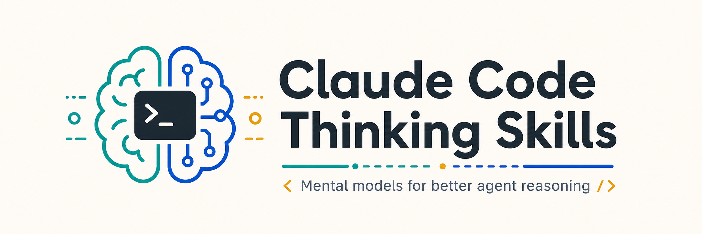

# Claude Code Thinking Skills

> **39 Mental Models and Frameworks for Critical Thinking in Claude Code**

A comprehensive collection of thinking skills for [Claude Code](https://claude.ai/claude-code) that enhance AI-assisted problem solving, decision making, and strategic analysis. These skills provide structured frameworks based on proven mental models from leaders in systems thinking, cognitive science, and strategic analysis.

[](https://github.com/tjboudreaux/cc-thinking-skills)
[](https://opensource.org/licenses/MIT)
[](https://github.com/tjboudreaux/cc-thinking-skills)



## Features

- **39 Thinking Frameworks** - Comprehensive mental models for better decision-making
- **Eval-Informed** - Backed by a rigorous replication-gated evaluation pipeline (see [Elevate-or-Kill Scorecard](analysis/ELEVATE-OR-KILL-SCORECARD.md))
- **Battle-Tested Foundations** - Based on proven frameworks from cognitive science and systems thinking
- **Claude Code Native** - Designed specifically for Claude Code's skill system
- **Quality Scripts** - Tools to validate and enhance skill quality
- **Zero Configuration** - Just install and invoke with skill names

## Quick Start

### Installation via Plugin Marketplace (Recommended)

Install directly in Claude Code using the plugin system:

```bash
# Add the marketplace
/plugin marketplace add tjboudreaux/cc-thinking-skills

# Install the plugin
/plugin install thinking-skills@thinking-skills-marketplace
```

### Alternative: Manual Installation

Clone and copy skills directly:

```bash
# Clone the repository
git clone https://github.com/tjboudreaux/cc-thinking-skills.git

# Copy skills to your global Claude Code config
cp -r cc-thinking-skills/skills/* ~/.claude/skills/

# Or copy to a specific project
cp -r cc-thinking-skills/skills/* /path/to/your/project/.claude/skills/
```

### Development: Load as Local Plugin

For testing or development:

```bash
claude --plugin-dir ./cc-thinking-skills
```

### Usage

Once installed, invoke any skill by name in Claude Code:

```
> Use first-principles thinking to analyze this architecture decision
> Apply the pre-mortem framework to this project plan
> Help me use Bayesian reasoning to evaluate this hypothesis
> Use the theory of constraints to find our bottleneck
```

## Available Skills

### Decision Making & Analysis

| Skill | Description | Best For |
|-------|-------------|----------|
| `thinking-first-principles` | Break problems into fundamental truths | Innovation, challenging assumptions |
| `thinking-second-order` | Think beyond immediate consequences | Strategic decisions, policy changes |
| `thinking-inversion` | Approach problems by identifying paths to failure | Risk identification, planning |
| `thinking-pre-mortem` | Imagine failure and work backward | Project kickoffs, risk assessment |
| `thinking-kepner-tregoe` | Systematic rational process for complex analysis | High-stakes decisions, root cause analysis |
| `thinking-reversibility` | Classify decisions by reversibility (Type 1/2) | Commitment sizing, risk assessment |
| `thinking-regret-minimization` | Project to future self to test decisions | Career choices, major life decisions |
| `thinking-opportunity-cost` | Evaluate choices by what you give up | Resource allocation, prioritization |

### Cognitive & Behavioral

| Skill | Description | Best For |
|-------|-------------|----------|
| `thinking-bayesian` | Update beliefs based on evidence | Probability estimation, uncertainty |
| `thinking-debiasing` | Identify and counteract cognitive biases | Major decisions, high stakes |
| `thinking-dual-process` | Recognize when to trust intuition vs. analysis | Speed vs. accuracy tradeoffs |
| `thinking-bounded-rationality` | Make good-enough decisions under constraints | Time pressure, satisficing |
| `thinking-socratic` | Systematic questioning framework | Requirements, debugging, coaching |
| `thinking-probabilistic` | Calibrated probability estimation | Forecasting, uncertainty quantification |
| `thinking-steel-manning` | Argue the strongest opposing position | Debate, decision validation |

### Systems & Strategy

| Skill | Description | Best For |
|-------|-------------|----------|
| `thinking-systems` | Analyze interconnected systems | Complex debugging, architecture |
| `thinking-feedback-loops` | Identify reinforcing and balancing loops | Growth design, organizational dynamics |
| `thinking-archetypes` | Recognize recurring system patterns | Organizational problems, recurring issues |
| `thinking-ooda` | Rapid decision-making for dynamic situations | Incident response, competitive scenarios |
| `thinking-leverage-points` | Find where small changes have big effects | System optimization, intervention design |
| `thinking-theory-of-constraints` | Identify and manage bottlenecks | Performance optimization, throughput |
| `thinking-cynefin` | Classify problems by complexity domain | Methodology selection, approach matching |

### Problem Solving & Innovation

| Skill | Description | Best For |
|-------|-------------|----------|
| `thinking-occams-razor` | Prefer simpler explanations | Debugging, architecture decisions |
| `thinking-map-territory` | Recognize limits of mental models | Expectation mismatches, abstractions |
| `thinking-circle-of-competence` | Know the boundaries of expertise | Delegation, learning decisions |
| `thinking-triz` | Resolve technical contradictions | Engineering design, innovation |
| `thinking-five-whys-plus` | Enhanced root cause analysis with bias guards | Debugging, incident postmortems |
| `thinking-scientific-method` | Hypothesis-differential debugging | Fault localization, ambiguous symptoms |
| `thinking-thought-experiment` | Structured imagination for exploration | Architecture, edge cases, philosophy |

### Estimation & Risk

| Skill | Description | Best For |
|-------|-------------|----------|
| `thinking-fermi-estimation` | Order-of-magnitude calculations | Quick sizing, feasibility checks |
| `thinking-margin-of-safety` | Build in buffers for uncertainty | Risk management, system design |
| `thinking-lindy-effect` | Older things likely to last longer | Technology selection, durability |
| `thinking-via-negativa` | Improve by removing, not adding | Simplification, robustness |
| `thinking-red-team` | Attack your own plans adversarially | Security review, plan validation |

### Product & Innovation

| Skill | Description | Best For |
|-------|-------------|----------|
| `thinking-jobs-to-be-done` | Understand the job customers hire products for | Product development, feature design |
| `thinking-effectuation` | Start with means, not goals | Startups, innovation, uncertainty |

### Meta-Skills

| Skill | Description | Best For |
|-------|-------------|----------|
| `thinking-model-router` | **START HERE** - Route to the right model by domain | Entry point for all thinking skills |
| `thinking-model-selection` | Choose the right model for the problem | New problems, approach selection |
| `thinking-model-combination` | Combine multiple models for richer analysis | Complex problems, high-stakes decisions |

## Quality Assurance Tools

This collection includes scripts to maintain and improve skill quality:

### Outcome Evals

The `evals/` and `experiments/` directories contain the current outcome-based harness:

- **Structural lint** for frontmatter and format checks
- **Routing evals** for skill discoverability and false-positive control
- **Length-controlled behavioral evals** using skill-vs-placebo prompts
- **Objective SWE-bench localization evals** for debugging skills
- **SQLite dashboard** for reviewing eval and experiment results

Current evidence is documented in the [Elevate-or-Kill Scorecard](analysis/ELEVATE-OR-KILL-SCORECARD.md) (canonical single source of truth for all 39 skills) and the [Executive Synthesis](analysis/ELEVATE-OR-KILL-SYNTHESIS.md). The mission's headline result: **zero skills currently hold a robust, replicated ELEVATE verdict.** `thinking-scientific-method` (hypothesis-differential debugging) is the closest candidate: its M5 fresh primary scored +5.3pp (p=0.061, n=150, directional) and its replication was significant (+8.0pp, p=0.001), but the primary's borderline p-value fails the paired-test gate — final verdict DIRECTIONAL-NOT-REPLICATED. A pre-registered larger-N study is recommended as future work. All 39 skills remain shipped; no directories were removed. See `analysis/ELEVATE-OR-KILL-SYNTHESIS.md` for the full executive summary and `analysis/FUTURE-CONSOLIDATION-PLAN.md` for a proposed (unexecuted) consolidation plan.

### Validate Skills

Check all skills against quality criteria:

```bash
node scripts/validate-skills.js
```

Outputs a report showing:
- Required sections present/missing
- Quality metrics (examples, tables, checklists)
- Overall score per skill
- Skills needing attention

### Generate Enhancement Suggestions

Get specific improvement suggestions for a skill:

```bash
# Single skill
node scripts/enhance-skill.js thinking-first-principles

# All skills summary
node scripts/enhance-skill.js
```

### Generate AI Improvement Prompts

Create prompts for Claude to enhance skills:

```bash
node scripts/generate-improvement-prompt.js thinking-bayesian
```

This generates a detailed prompt you can use with Claude Code to systematically improve any skill.

## Detailed Skill Descriptions

### First Principles Thinking
Strip away assumptions to reveal fundamental truths, then rebuild solutions from basics. Championed by Elon Musk and rooted in Aristotle's philosophy.

**When to use:**
- Conventional approaches have failed
- You're told something is "impossible"
- Need innovation, not incremental improvement

### Bayesian Reasoning
Update beliefs systematically based on new evidence. Provides a framework for thinking about probability and uncertainty.

**When to use:**
- Estimating probabilities or likelihoods
- Interpreting test results or metrics
- Making decisions with incomplete information

### Systems Thinking
View problems as part of interconnected wholes with feedback loops and emergent properties. Essential for debugging complex distributed systems.

**When to use:**
- Debugging spans multiple components
- Fix in one place breaks another
- Behavior seems emergent or unexpected

### Theory of Constraints
Every system has exactly one constraint limiting throughput. Optimizing anything else is wasted effort. Based on Eliyahu Goldratt's work.

**When to use:**
- Performance optimization
- Process improvement
- Resource allocation
- Identifying bottlenecks

### Scientific Method / Hypothesis-Differential Debugging
Localize an ambiguous bug by enumerating falsifiable hypotheses, ranking them by likelihood x cheapness-to-check, and making the cheapest discriminating observation first.

**When to use:**
- A symptom could plausibly come from several files/functions/components
- You can inspect code, logs, diffs, traces, or tests now
- You need to localize the fault before applying root-cause analysis

### Cynefin Framework
Classify problems by the relationship between cause and effect: Clear, Complicated, Complex, or Chaotic. Each domain requires a different approach.

**When to use:**
- Choosing methodologies
- Understanding why approaches fail
- Crisis management

### Jobs to Be Done
Customers don't buy products—they hire them to do jobs. Understanding the job unlocks innovation.

**When to use:**
- Product development
- Feature prioritization
- Understanding customer behavior

### Red Team Thinking
Attack your own plans before adversaries do. The best defense is knowing your weaknesses.

**When to use:**
- Security review
- Pre-launch preparation
- Plan stress-testing

## Contributing

We welcome contributions! See [CONTRIBUTING.md](CONTRIBUTING.md) for guidelines.

### Adding New Skills

1. Create a new directory under `skills/` with the format `thinking-{name}`
2. Add a `SKILL.md` file with YAML frontmatter:
```yaml
---
name: thinking-your-skill-name
description: Brief description under 200 chars (used by Claude Code for skill matching)
---
```
3. Write comprehensive documentation with:
   - Overview and core principle
   - When to use decision flow
   - Step-by-step process
   - At least 2 practical examples
   - Reusable template
   - Verification checklist
   - Key questions

4. Validate your skill:
```bash
node scripts/validate-skills.js
```

## Keywords

`claude-code` `claude` `anthropic` `ai` `skills` `mental-models` `critical-thinking` `decision-making` `problem-solving` `systems-thinking` `first-principles` `bayesian-reasoning` `cognitive-bias` `strategic-thinking` `frameworks` `triz` `ooda` `pre-mortem` `socratic-method` `theory-of-constraints` `cynefin` `jobs-to-be-done` `red-team` `fermi-estimation`

## Related Resources

- [Claude Code Documentation](https://docs.anthropic.com/claude-code)
- [Charlie Munger's Mental Models](https://fs.blog/mental-models/)
- [Thinking in Systems - Donella Meadows](https://www.chelseagreen.com/product/thinking-in-systems/)
- [Thinking, Fast and Slow - Daniel Kahneman](https://www.amazon.com/Thinking-Fast-Slow-Daniel-Kahneman/dp/0374533555)
- [The Goal - Eliyahu Goldratt](https://www.amazon.com/Goal-Process-Ongoing-Improvement/dp/0884271951)

## License

MIT License - see [LICENSE](LICENSE) for details.

## Author

Created by [TJ Boudreaux](https://github.com/tjboudreaux)

---

**Found this useful?** Give it a star and share with others who could benefit from better thinking frameworks in Claude Code.
